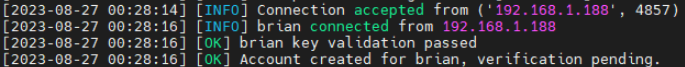
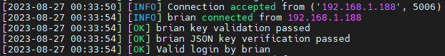
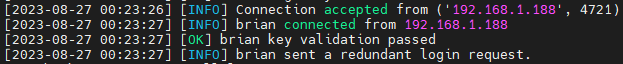
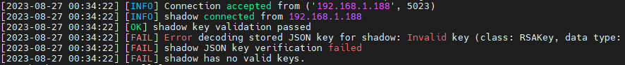
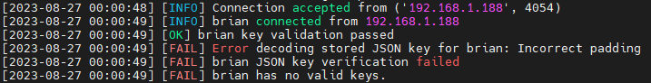
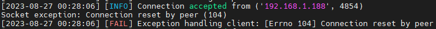

# Artifact Toolkit

## Table of Contents
- [Overview](#overview)
- [Features](#features)
- [Prerequisites](#prerequisites)
- [Installation](#installation)
- [Usage](#usage)
- [Reference Output](#reference-output)
- [Development](#development)

## Overview
Artifact Toolkit is a collection of Dockerized services focusing on secure sharing of artifacts and tools during a pentesting engagement. One member of the team will host the services, while the other members hoook in to share/pull as needed. All user sessions are invalidated on boot (adjustable time limit pending). The primary service is Krypt-Server, a PKI/JSON based authentication service running in the artifacttoolkit-auth container. [Pending:] After the user authenticates with the Krypt server and receives a valid session, their IP is whitelisted with the other services.

## Features
- PKI-based authentication using public keys
- JSON data storage for user information
- Dockerized services for easy deployment
- Extensible architecture for future services

## Prerequisites
### Server
- [Docker](https://www.docker.com/)
- [Docker-Compose](https://docs.docker.com/compose/)

Or

- [Podman](https://podman.io/)
- [Podman-Compose](https://github.com/containers/podman-compose)

### Client
- [SSH](https://www.ssh.com/academy/ssh) (pending custom binary)

## Installation
1. Clone the repository:
    ```bash
    git clone https://github.com/0xdreadnaught/ArtifactToolkit.git
    ```
2. Copy `.env-sample` to `.env` and update the environment variables as needed.
    ```bash
    cp .env-sample .env
    ```
3. Build and run the Docker services:
    ```bash
    docker-compose up -d
    ```
4. Add users to `user_data.json` (optional).

## Usage

### Login
To log in, use the following command:
```bash
ssh -p 2222 username@server_address login
```
This will authenticate you and grant access to other services.

### List Users [authenticated]
To list all registered and pending users, use:
```bash
ssh -p 2222 username@server_address list-users
```

### List Keys [authenticated]
To list all your public keys stored on the server, use:
```bash
ssh -p 2222 username@server_address list-keys
```

### Prune Keys [authenticated] (pending)
To remove all unused keys, use: 
```bash
ssh -p 222 username@server_address prune-keys
```
**Note**: Thid will delete all but the currently active key.

### Purge Keys [authenticated]
To remove all your stored keys, use:
```bash
ssh -p 2222 username@server_address purge-keys
```
**Note**: This will remove all your keys, and you'll need to re-upload them for future authentication.

## Reference Output
### User Registration

### User Login

### Duplicate Login

### Invalid Login

### Missing Key

### Malformed Command



## Development
The auth container is done for now. Next step is a storage solution. NFS/SMB aren't worth the time given the security/ease of use desired, SFTP is clunky ... I'll think of something ...


